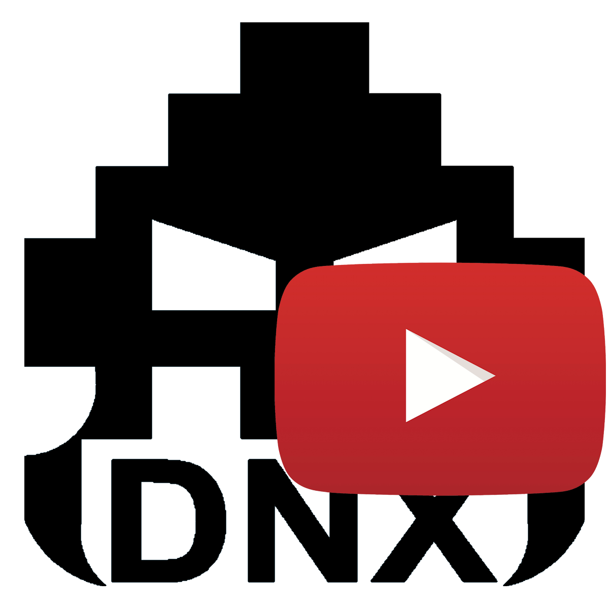

# DNXYoutubeDownloader
Web interface for yt-dlp


# DNX Youtuber Downloader

Una aplicación de escritorio moderna y eficiente para descargar videos y audio de YouTube, con una interfaz web limpia y funcionalidades avanzadas como historial persistente y minimización a la bandeja del sistema.



## Características

-   **Interfaz Web Moderna**: Diseño oscuro, limpio y responsivo.
-   **Cola de Descargas**: Añade múltiples enlaces y deja que la app trabaje en segundo plano.
-   **Historial Persistente**: Mantiene un registro de tus descargas con miniaturas reales, calidad y tipo de archivo, incluso tras reiniciar.
-   **System Tray**: Se minimiza al área de notificaciones para no molestar.
-   **Formatos**: Soporte para Video (MP4/MKV) y Audio (MP3) con selección de calidad.
-   **Portable**: Todo empaquetado en un solo ejecutable (tras compilar).

## Requisitos Previos

Para ejecutar este proyecto (ya sea desde el código fuente o compilándolo), necesitas configurar las herramientas externas en la carpeta `Tools`.

### Carpeta `Tools/`

Debes crear una carpeta llamada `Tools` en la raíz del proyecto y colocar dentro los siguientes ejecutables:

1.  **yt-dlp.exe**: El motor de descarga.
    *   Descarga: [https://github.com/yt-dlp/yt-dlp/releases/latest](https://github.com/yt-dlp/yt-dlp/releases/latest) (Busca `yt-dlp.exe`)
2.  **FFmpeg**: Necesario para unir audio y video y convertir formatos.
    *   Descarga: [https://www.gyan.dev/ffmpeg/builds/](https://www.gyan.dev/ffmpeg/builds/) (Descarga una "release build" o "git master", extrae el ZIP y busca los `.exe` en la carpeta `bin`).
    *   Archivos necesarios en `Tools/`:
        *   `ffmpeg.exe`
        *   `ffprobe.exe`

La estructura debe quedar así:
```
/
├── server.py
├── ...
└── Tools/
    ├── yt-dlp.exe
    ├── ffmpeg.exe
    └── ffprobe.exe
```

## Ejecución desde Código Fuente

1.  Instala Python 3.10+
2.  Instala las dependencias:
    ```bash
    pip install pillow pystray
    ```
3.  Ejecuta el servidor:
    ```bash
    python server.py
    ```
4.  Abre tu navegador en `http://localhost:5900` (o usa el icono de la bandeja del sistema).

## Compilación (Crear EXE)

Para generar un ejecutable único (`.exe`) que contenga la web y todas las dependencias (excepto la carpeta `Tools`, que debe estar junto al exe):

```powershell
pyinstaller --onefile --clean --name "DNX Youtuber Downloader" --icon "DNXYoutubeDownloaderWeb.ico" --add-data "index.html;." --add-data "index.css;." --add-data "assets;assets" --hidden-import pystray --hidden-import PIL --hidden-import PIL._tkinter_finder server.py
```

## Uso

1.  Ejecuta `DNX Youtuber Downloader.exe`.
2.  Aparecerá un icono en la bandeja del sistema (junto al reloj).
3.  Pega un enlace de YouTube en la caja de texto.
4.  Elige Formato (Video/Audio) y Calidad.
5.  Haz clic en "Añadir a Cola".
6.  ¡Listo! El archivo se descargará en la carpeta `Downloads`.

## Nota

La interfaz está en español, pero es fácil cambiarla a otro idioma.

By: DNX.Projects

_____________________________________________________________________________________ ENGLISH

A modern and efficient desktop application to download videos and audio from YouTube, featuring a clean web interface, persistent history, and system tray minimization.


## Features
-   **Modern Web Interface**: Clean, dark, and responsive design.
-   **Download Queue**: Add multiple links and let the app work in the background.
-   **Persistent History**: Keeps a record of your downloads with real thumbnails, quality, and file type, even after restarting.
-   **System Tray**: Minimizes to the notification area to avoid clutter.
-   **Formats**: Support for Video (MP4/MKV) and Audio (MP3) with quality selection.
-   **Portable**: All packed into a single executable (after compiling).
## Prerequisites
To run this project (either from source or compiled), you need to configure external tools in the `Tools` folder.
### `Tools/` Folder
You must create a folder named `Tools` in the project root and place the following executables inside:
1.  **yt-dlp.exe**: The download engine.
    *   Download: [https://github.com/yt-dlp/yt-dlp/releases/latest](https://github.com/yt-dlp/yt-dlp/releases/latest) (Look for `yt-dlp.exe`)
2.  **FFmpeg**: Required to merge audio/video and convert formats.
    *   Download: [https://www.gyan.dev/ffmpeg/builds/](https://www.gyan.dev/ffmpeg/builds/) (Download a "release build" or "git master", extract the ZIP, and find the `.exe` files in the `bin` folder).
    *   Required files in `Tools/`:
        *   `ffmpeg.exe`
        *   `ffprobe.exe`
The structure should look like this:
```
/
├── server.py
├── ...
└── Tools/
    ├── yt-dlp.exe
    ├── ffmpeg.exe
    └── ffprobe.exe
```
## Running from Source
1.  Install Python 3.10+
2.  Install dependencies:
    ```bash
    pip install pillow pystray
    ```
3.  Run the server:
    ```bash
    python server.py
    ```
4.  Open your browser at `http://localhost:5900` (or use the system tray icon).
## Compiling (Create EXE)
To generate a single executable (`.exe`) containing the web assets and dependencies (except the `Tools` folder, which stays external):
```powershell
pyinstaller --onefile --clean --name "DNX Youtuber Downloader" --icon "DNXYoutubeDownloaderWeb.ico" --add-data "index.html;." --add-data "index.css;." --add-data "assets;assets" --hidden-import pystray --hidden-import PIL --hidden-import PIL._tkinter_finder server.py
```
## Usage
1.  Run `DNX Youtuber Downloader.exe`.
2.  An icon will appear in the system tray (next to the clock).
3.  Paste a YouTube link in the text box.
4.  Choose Format (Video/Audio) and Quality.
5.  Click "Add to Queue".
6.  Done! The file will be downloaded to the `Downloads` folder.

## Note

The interface is in spanish, but is easy to change to another language.

By: DNX.Projects
